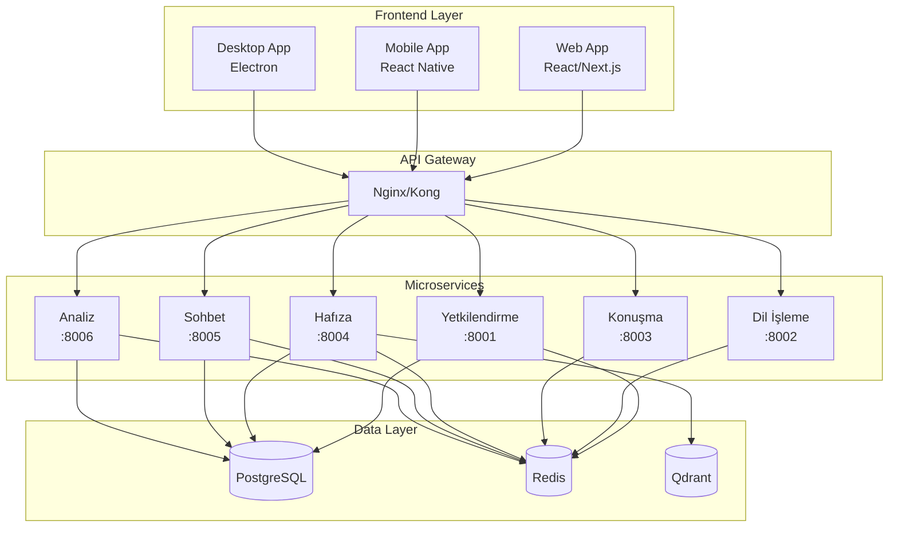

# 🤖 EyAy.OS 2.0 - Modern Turkish AI Assistant Platform

<div align="center">


[](https://opensource.org/licenses/MIT)
[](https://www.python.org/downloads/)
[](https://www.docker.com/)
[](https://kubernetes.io/)

**Modern mikroservis mimarisi ile geliştirilmiş Türkçe AI asistan platformu**

[🚀 Hızlı Başlangıç](#-hızlı-başlangıç) • [📖 Dokümantasyon](#-dokümantasyon) • [🏗️ Mimari](#️-mimari) • [🤝 Katkıda Bulunma](#-katkıda-bulunma)

</div>

## ✨ Özellikler

### 🎯 Temel Yetenekler
- **🇹🇷 Türkçe AI Desteği**: Özel eğitilmiş Türkçe NLP modelleri
- **🗣️ Ses İşleme**: Whisper tabanlı ses tanıma ve TTS sentezi
- **🧠 Akıllı Hafıza**: Vektör tabanlı konuşma hafızası
- **💬 Gerçek Zamanlı Sohbet**: WebSocket ile anlık iletişim
- **📊 Analitik Dashboard**: Kapsamlı kullanım metrikleri

### 🏗️ Teknik Özellikler
- **Mikroservis Mimarisi**: 6 bağımsız, ölçeklenebilir servis
- **Modern Tech Stack**: FastAPI, React, PostgreSQL, Redis, Qdrant
- **Container-Native**: Docker ve Kubernetes desteği
- **API-First**: RESTful API'ler ve GraphQL desteği
- **Cloud-Ready**: AWS, GCP, Azure uyumlu

## 🚀 Hızlı Başlangıç

### Ön Gereksinimler
- Docker 24.0+
- Docker Compose 2.20+
- Python 3.11+
- Node.js 18+

### 1. Repository'yi Klonlayın
```bash
git clone https://github.com/barutseref/EyAy.OS.git
cd EyAy.OS
```

### 2. Geliştirme Ortamını Başlatın
```bash
# Tüm servisleri Docker Compose ile başlat
docker-compose up -d

# Servislerin durumunu kontrol et
docker-compose ps
```

### 3. Sağlık Kontrolü
```bash
# Tüm servislerin çalıştığını doğrula
curl http://localhost:8001/saglik  # Yetkilendirme
curl http://localhost:8002/saglik  # Dil İşleme
curl http://localhost:8003/saglik  # Konuşma
curl http://localhost:8004/saglik  # Hafıza
curl http://localhost:8005/saglik  # Sohbet
curl http://localhost:8006/saglik  # Analiz
```

### 4. Web Arayüzüne Erişim
```bash
# Frontend'i başlat
cd frontend/web-app
npm install && npm run dev

# Tarayıcıda açın: http://localhost:3000
```

## 🏗️ Mimari



## 📋 Servis Detayları

| Servis | Port | Açıklama | Teknolojiler |
|--------|------|----------|-------------|
| **Yetkilendirme** | 8001 | JWT tabanlı kimlik doğrulama | FastAPI, SQLAlchemy, PostgreSQL |
| **Dil İşleme** | 8002 | Türkçe NLP ve AI işlemleri | Transformers, spaCy, Hugging Face |
| **Konuşma** | 8003 | Ses tanıma ve sentezi | Whisper, TTS, PyAudio |
| **Hafıza** | 8004 | Konuşma hafızası ve vektör DB | Qdrant, Sentence Transformers |
| **Sohbet** | 8005 | Gerçek zamanlı sohbet | WebSocket, Socket.IO |
| **Analiz** | 8006 | Metrikler ve dashboard | Prometheus, InfluxDB, Pandas |

## 🛠️ Geliştirme

### Yerel Geliştirme Ortamı

```bash
# Belirli bir servisi geliştirmek için
cd hizmetler/yetkilendirme

# Poetry ile bağımlılıkları yükle
poetry install

# Geliştirme sunucusunu başlat
poetry run uvicorn app.eyay:app --reload --port 8001
```

### Test Çalıştırma

```bash
# Tüm testleri çalıştır
./scripts/run-tests.sh

# Belirli bir servisin testleri
cd hizmetler/dil_isleme
poetry run pytest
```

### Code Quality

```bash
# Pre-commit hooks kurulumu
pre-commit install

# Manuel code formatting
black .
ruff check . --fix
mypy .
```

## 📖 Dokümantasyon

### 📚 Detaylı Rehberler
- [📋 Kapsamlı Kurulum Rehberi](KAPSAMLI_KURULUM_REHBERI.md)
- [🔐 Yetkilendirme Servisi](yetkilendirme-servisi-template.md)
- [🧠 Dil İşleme Servisi](dil-isleme-servisi-template.md)
- [🗣️ Konuşma Servisi](konusma-servisi-template.md)
- [💾 Hafıza Servisi](hafiza-servisi-template.md)
- [💬 Sohbet Servisi](sohbet-servisi-template.md)
- [📊 Analiz Servisi](analiz-servisi-template.md)

### 🔗 API Dokümantasyonu
- Yetkilendirme API: http://localhost:8001/docs
- Dil İşleme API: http://localhost:8002/docs
- Konuşma API: http://localhost:8003/docs
- Hafıza API: http://localhost:8004/docs
- Sohbet API: http://localhost:8005/docs
- Analiz API: http://localhost:8006/docs

## 🚀 Production Deployment

### Docker Compose (Basit)
```bash
# Production ortamı için
docker-compose -f docker-compose.prod.yml up -d
```

### Kubernetes (Gelişmiş)
```bash
# Helm ile deployment
helm install eyayos ./infrastructure/helm/eyayos

# Manuel Kubernetes deployment
kubectl apply -f infrastructure/kubernetes/
```

### Cloud Providers
- **AWS**: EKS + RDS + ElastiCache
- **GCP**: GKE + Cloud SQL + Memorystore
- **Azure**: AKS + Azure Database + Redis Cache

## 📊 Performans

### Benchmark Sonuçları
- **Yanıt Süresi**: < 200ms (ortalama)
- **Throughput**: 1000+ req/sec
- **Eş Zamanlı Kullanıcı**: 10,000+
- **Uptime**: %99.9+

### Ölçeklenebilirlik
- **Horizontal Scaling**: Kubernetes HPA
- **Vertical Scaling**: Resource limits
- **Database Scaling**: Read replicas
- **Cache Scaling**: Redis Cluster

## 🔒 Güvenlik

### Güvenlik Özellikleri
- **JWT Authentication**: Secure token-based auth
- **Rate Limiting**: API abuse protection
- **CORS Protection**: Cross-origin security
- **SQL Injection Protection**: Parameterized queries
- **XSS Protection**: Input sanitization

### Compliance
- **GDPR**: Veri koruma uyumluluğu
- **KVKK**: Türk veri koruma yasası
- **ISO 27001**: Bilgi güvenliği standardı

## 🌍 Uluslararasılaştırma

### Desteklenen Diller
- 🇹🇷 **Türkçe** (Ana dil)
- 🇺🇸 **İngilizce** (Planlanan)
- 🇩🇪 **Almanca** (Planlanan)
- 🇫🇷 **Fransızca** (Planlanan)

### Yerelleştirme
- Tarih/saat formatları
- Sayı formatları
- Para birimi
- Kültürel adaptasyon

## 🤝 Katkıda Bulunma

### Katkı Süreci
1. **Fork** yapın
2. **Feature branch** oluşturun (`git checkout -b feature/yeni-ozellik`)
3. **Commit** yapın (`git commit -am 'Yeni özellik eklendi'`)
4. **Push** edin (`git push origin feature/yeni-ozellik`)
5. **Pull Request** oluşturun

### Geliştirme Kuralları
- **Code Style**: Black + Ruff
- **Type Hints**: Zorunlu
- **Tests**: %90+ coverage
- **Documentation**: Docstrings gerekli
- **Commit Messages**: Conventional Commits

### Topluluk
- **Discord**: [EyAy.OS Geliştirici Sunucusu](https://discord.gg/eyayos)
- **GitHub Discussions**: Sorular ve öneriler
- **Weekly Meetings**: Pazartesi 20:00 (GMT+3)

## 📈 Roadmap

### 2024 Q1
- [x] Mikroservis mimarisi
- [x] Temel AI entegrasyonu
- [ ] Web arayüzü
- [ ] Beta release

### 2024 Q2
- [ ] Mobile uygulama
- [ ] Gelişmiş AI modelleri
- [ ] Multi-tenant support
- [ ] v1.0 release

### 2024 Q3
- [ ] Desktop uygulama
- [ ] Plugin sistemi
- [ ] Enterprise features
- [ ] Cloud marketplace

### 2024 Q4
- [ ] Multi-language support
- [ ] Advanced analytics
- [ ] AI model marketplace
- [ ] v2.0 planning

## 📄 Lisans

Bu proje [MIT Lisansı](LICENSE) altında lisanslanmıştır.

```
MIT License

Copyright (c) 2024 Barut Şeref

Permission is hereby granted, free of charge, to any person obtaining a copy
of this software and associated documentation files (the "Software"), to deal
in the Software without restriction, including without limitation the rights
to use, copy, modify, merge, publish, distribute, sublicense, and/or sell
copies of the Software, and to permit persons to whom the Software is
furnished to do so, subject to the following conditions:

The above copyright notice and this permission notice shall be included in all
copies or substantial portions of the Software.

THE SOFTWARE IS PROVIDED "AS IS", WITHOUT WARRANTY OF ANY KIND, EXPRESS OR
IMPLIED, INCLUDING BUT NOT LIMITED TO THE WARRANTIES OF MERCHANTABILITY,
FITNESS FOR A PARTICULAR PURPOSE AND NONINFRINGEMENT. IN NO EVENT SHALL THE
AUTHORS OR COPYRIGHT HOLDERS BE LIABLE FOR ANY CLAIM, DAMAGES OR OTHER
LIABILITY, WHETHER IN AN ACTION OF CONTRACT, TORT OR OTHERWISE, ARISING FROM,
OUT OF OR IN CONNECTION WITH THE SOFTWARE OR THE USE OR OTHER DEALINGS IN THE
SOFTWARE.
```

## 🙏 Teşekkürler

### Açık Kaynak Projeler
- [FastAPI](https://fastapi.tiangolo.com/) - Modern Python web framework
- [Transformers](https://huggingface.co/transformers/) - NLP model library
- [Whisper](https://openai.com/research/whisper) - Speech recognition
- [Qdrant](https://qdrant.tech/) - Vector database
- [React](https://reactjs.org/) - Frontend library

### Türkçe NLP Modelleri
- [savasy/bert-base-turkish-sentiment-cased](https://huggingface.co/savasy/bert-base-turkish-sentiment-cased)
- [emrecan/bert-base-turkish-cased-mean-nli-stsb-tr](https://huggingface.co/emrecan/bert-base-turkish-cased-mean-nli-stsb-tr)
- [savasy/bert-base-turkish-ner-cased](https://huggingface.co/savasy/bert-base-turkish-ner-cased)

### Topluluk
- Türkçe NLP topluluğu
- Python Türkiye
- Kubernetes Türkiye
- AI/ML Türkiye

---

<div align="center">

**EyAy.OS ile Türkçe AI'nın geleceğini şekillendirin! 🚀**

[⭐ Star](https://github.com/barutseref/EyAy.OS) • [🐛 Issue](https://github.com/barutseref/EyAy.OS/issues) • [💬 Discussions](https://github.com/barutseref/EyAy.OS/discussions)

</div>
